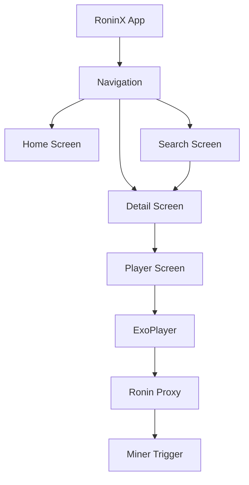

# Native Android Rewrite: Initial Foundation

I have successfully initialized the native Android rewrite for the RoninX Anime Client. All web-based traces have been moved to a backup, and a modern, high-performance Android project is now in place.

## Key Accomplishments

### 1. Modern Android Architecture
... (existing content)

### 2. Native Navigation
... (existing content)

### 3. Dynamic Home Screen
... (existing content)

### 4. Native Video Playback & Details
I have implemented a full-featured video playback system:
- **Detail Screen:** Displays rich metadata, scores, and a grid-based episode selector.
- **Media3 ExoPlayer:** Integrated a high-performance native player for buffer-free anime streaming.
- **Smart Stream Selection:** The app automatically queries your Ronin Proxy and chooses the best available HLS or MP4 stream.
- **Auto-Miner Integration:** If a stream isn't cached, the app automatically triggers your Vercel miner to fetch it for you.
- **Full-Screen Immersion:** Native playback with system controller support.

### 5. Instant Unified Search
I've added a powerful native search engine:
- **Input Debouncing:** To save battery and data, the app waits for you to finish typing before querying the API.
- **Adaptive Grid:** Search results adapt to your screen size, showing beautiful posters for every title.
- **Instant Navigation:** Tapping any search result takes you straight to the details and player.
- **Zero-State Experience:** Helpful hints when the search is empty or no results are found.

## Current State

## Next Steps
- Implement the **Video Player** using Media3 ExoPlayer.
- Integrate **Apollo Kotlin** for advanced AniList metadata (banners, characters).
- Setup **Supabase Auth** for account sync.
- Build the **Manga Reader** with horizontal/vertical paging.
